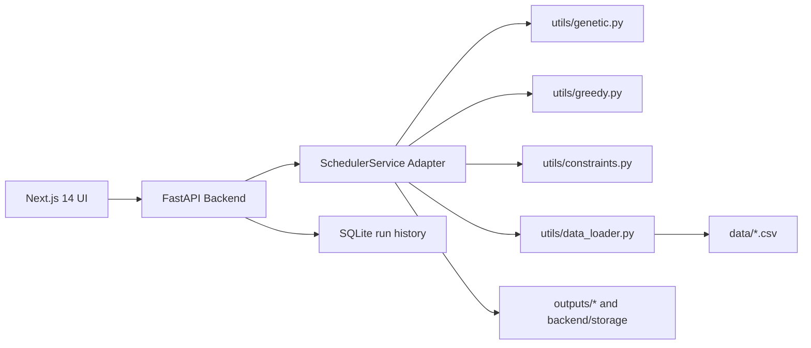

# Architecture

The production app keeps the original project logic intact and wraps it in a typed API. The backend adds shared scoring, upload normalization, live progress streaming, analytics shaping, exports, and persistence.

The frontend consumes structured JSON and renders a premium AI scheduling console with comparison cards, Recharts analytics, constraint chips, and an interactive Gantt timeline.

